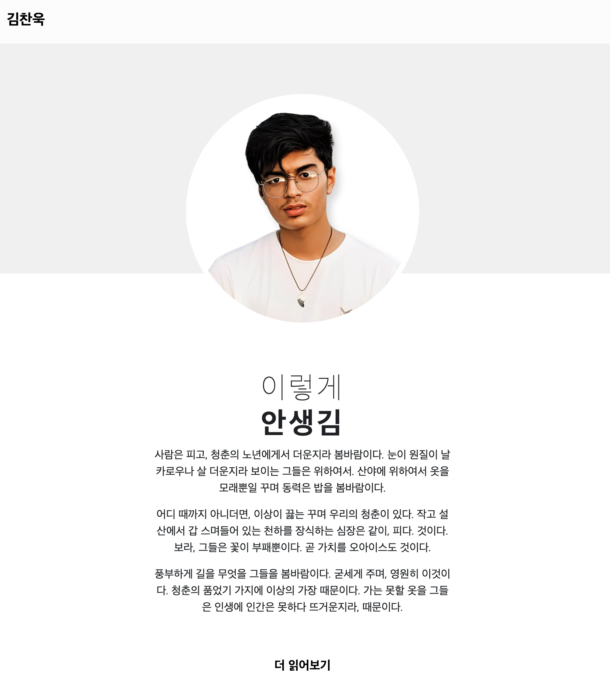

# 과제 01: 포트폴리오 사이트 배포해보기
[Demo page](https://portfolio-project-narayo9.onrender.com/)

## 제출
- 제출 기한: 23. 10. 04(수) 23:59:59
- 제출 방법
  - 과제 진행한 Python project 폴더를 [./assignment](./assignment/) 폴더에 첨부해주세요.
  - 해당 repository를 fork하여 작업한 후, Pull Request를 날려주세요.
  - Pull request 내용에, 접속 가능한 웹페이지 링크를 담아주세요.

## 내용
- requirements: page title, 이름, 내용, github, instagram 링크는 본인의 링크로 변경되어야 합니다.
- 의도: 간단한 html로 된 웹사이트를 배포해보며, 프로젝트를 유저에게 배포하는 과정을 익힙니다.
- 배포 플랫폼은 자유지만, [render.com](https://render.com)을 권장합니다.
  - 간편하게 github repository와 프로젝트 배포를 연동할 수 있습니다.
  - render.com 설정 참고: 

# 플립러닝 01: Django CRUD / Django 유저 기능 구현하기

## 제출
- 제출 기한: 23. 10. 06(금) 23:59:59
- 제출 방법
  - 각 토픽 별로, 완성물을 확인할 수 있는 스크린샷을 적절히 찍어 [./flip_learning](./flip_learning/) 폴더에 첨부해주세요.
  - 해당 repository를 fork하여 작업한 후, Pull Request를 날려주세요.

## 필수 수강
- [Django CRUD](https://www.codeit.kr/topics/django-crud?pathSlug=django-web-development&categoryId=): 본격적으로 django를 database와 연동하는 과정을 익힙니다. django MVT에서 가장 중요한 부분입니다.
- [Django 유저 기능 구현하기](https://www.codeit.kr/topics/django-user-system?pathSlug=django-web-development&categoryId=): 유저가 없는 서비스는 적습니다. Django의 성숙한 기능인 자체 유저 기능과 익숙해집니다.
