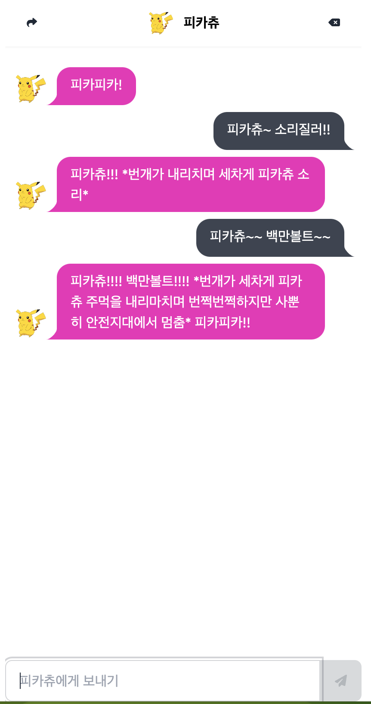
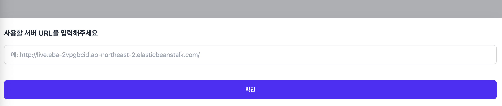

# 최종 과제: 나만의 챗봇 만들기

## 제출
- 제출 기한: 23. 12. 13(수) 23:59:59
- 제출 방법
  - 과제 진행한 Python project 폴더를 [./assignment](./assignment/) 폴더에 첨부해주세요.
  - 해당 repository를 fork하여 작업한 후, Pull Request를 날려주세요.

## 내용


GPT API를 이용해서 나만의 챗봇을 만들어보아요!

### 목적
- GPT 챗봇은 어떻게 만드는 걸까요? 2023년 가장 뜨거운 주제인, LLM API의 간단한 사용 방법에 대해 익힙니다.
  - (창의성을 발휘해보세요!)
- image는 SQL DB에 저장할 수 없습니다. s3를 이용한 image 저장 방법에 대해 익힙니다.
- React frontend에 연결하는 REST API를 작성해보며, 실제 경험하게 될 백엔드 개발과 유사한 경험을 해봅니다.
- 기존 rest framework requirements에서 벗어난 구현을 해봅니다.

### 구현 상세
- [채팅 프론트엔드](http://ec2-43-200-76-125.ap-northeast-2.compute.amazonaws.com/)에 연결할 백엔드 사이트를 배포합니다.
  - 해당 웹사이트에 들어가 본인 서버의 url을 입력하면, 본인 서버와 연결되게 할 수 있습니다.
  - localhost를 테스트하기 위해서는, 브라우저에서의 추가 설정이 필요합니다.
    - [링크 참조](https://nankisu.tistory.com/67)



- 세 가지 API Endpoints만 구현하면 됩니다.
  - `/chat/character/`:
    - `GET` 캐릭터에 대한 정보를 내려줍니다.
  - `/chat/chats/`
    - `GET` 채팅 목록을 내려줍니다. (character.first_message는 반드시 포함되어야 합니다.)
    - `POST` 새로운 채팅을 추가하고, GPT API와 소통해 캐릭터의 새로운 채팅을 만듭니다.
  - `/chat/chats/delete-all/`
    - `POST, DELETE` 지금까지의 전체 채팅을 삭제합니다.

- 기재되지 않은 자세한 구현 상세는, 채팅 프론트엔드의 구현을 참고해 조금 더 유저가 편한 방향으로 결정해주세요.
  - 해당 서버 URL을 채팅 프론트엔드에 사용하면, 정답 구현을 참고할 수 있습니다.
  - 서버 URL의 API Schema를 확인할 수 있는 [swagger-ui](http://live.eba-2vpgbcid.ap-northeast-2.elasticbeanstalk.com/swagger/)도 참고해주세요.

```
http://live.eba-2vpgbcid.ap-northeast-2.elasticbeanstalk.com/
```


# 플립러닝 04

> Django 관련된 강의는 모두 수강했으므로, 필수로 수강해야 할 플립 러닝은 없습니다.
> 하지만 하단 내용은 평생 개발에 도움이 되는 내용들이랍니다. 한 번쯤 맛보기를 추천드려요!

## 선택 수강
- [객체 지향 프로그래밍의 4개의 기둥](https://www.codeit.kr/topics/getting-started-with-django?pathSlug=python-fullstack-developer&categoryId=6482cda0014b184405fe33b1)
- [견고한 객체 지향 프로그래밍](https://www.codeit.kr/topics/solid-principles-of-oop?pathSlug=object-oriented-programming-python&categoryId=62c288e9672c77328d2aa4a7)
